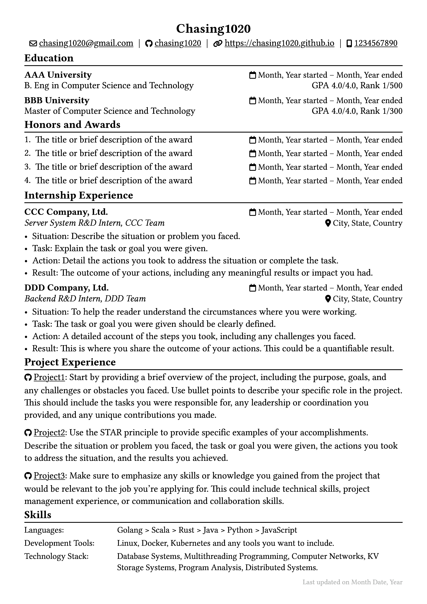

# Typst CV template

This is a Typst template for a professional resume. The template is designed to be easy to customize and modify, allowing you to create a personalized and professional-looking resume in no time.

# Preview



# Features

- Clean and modern design
- Customizable text attributes
- Easy-to-use functions for formatting section content
- Responsive layout for printing and digital use.

# Usage

To use this template, you'll need to have Typst installed on your computer. Typst is available through several package managers:

```bash
# macOS
brew install typst

# Arch
pacman -S typst
```

Once you have Typst installed, you can use the typst command to generate a PDF file from the template:

```bash
# Use the command
typst resume.typ resume.pdf

# or just
make
```

# Customization

To customize the template for your own use, you can modify the following elements:

- Text attributes: Use the set text command to define the font, size, color, and other attributes for text elements.
- Icons: Use the let icon command to define custom icons for section headings. Currently this project uses [fontawesome](https://fontawesome.com/v4/license/).
- Section headings: Use the show heading command to format section headings.
- Section content: Use the set text command to format section content.
- Page layout: Use the set page command to define the paper size, margins, and other attributes of the resume.

# License

This template is released under the Apache License. See the [LICENSE](./LICENSE) file for more details.

# Credits

This template was created by [Chasing1020](https://github.com/Chasing1020). If you have any questions or feedback, please feel free to contact me at chasing1020@gmail.com.
